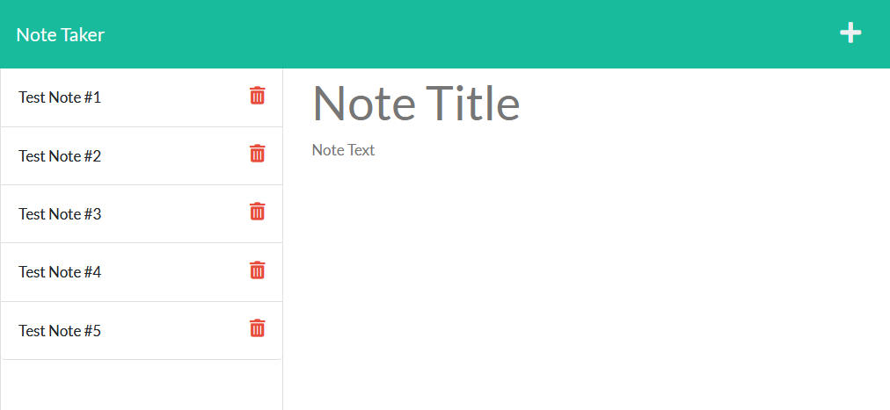
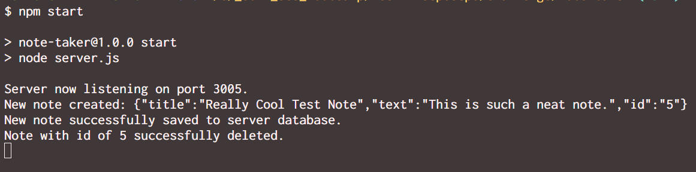

# Express.js Note Taking Server

## Description

An online notetaking server built using express.js

## Table of Contents
- [Installation](#installation)
- [Usage](#usage)
- [Images](#images)

- [Credits](#credits)

- [License](#license)

## Installation

This application uses Node.js for its server-side code; in order to install the necessary dependencies to get it running, simply navigate to the directory containing server.js and make sure to run "npm i" in the command line.

## Usage

Once Node Package Manager has installed the necessary dependencies, the server can be run by typing "npm start" in the command line from the directory containing server.js.

## Images

## Credits

Created by [Daniel Brackenbury](https://github.com/helpvisa).

## License

Copyright 2022 Daniel Brackenbury

Permission is hereby granted, free of charge, to any person obtaining a copy of this software and associated documentation files (the "Software"), to deal in the Software without restriction, including without limitation the rights to use, copy, modify, merge, publish, distribute, sublicense, and/or sell copies of the Software, and to permit persons to whom the Software is furnished to do so, subject to the following conditions:

The above copyright notice and this permission notice shall be included in all copies or substantial portions of the Software.

THE SOFTWARE IS PROVIDED "AS IS", WITHOUT WARRANTY OF ANY KIND, EXPRESS OR IMPLIED, INCLUDING BUT NOT LIMITED TO THE WARRANTIES OF MERCHANTABILITY, FITNESS FOR A PARTICULAR PURPOSE AND NONINFRINGEMENT. IN NO EVENT SHALL THE AUTHORS OR COPYRIGHT HOLDERS BE LIABLE FOR ANY CLAIM, DAMAGES OR OTHER LIABILITY, WHETHER IN AN ACTION OF CONTRACT, TORT OR OTHERWISE, ARISING FROM, OUT OF OR IN CONNECTION WITH THE SOFTWARE OR THE USE OR OTHER DEALINGS IN THE SOFTWARE.
